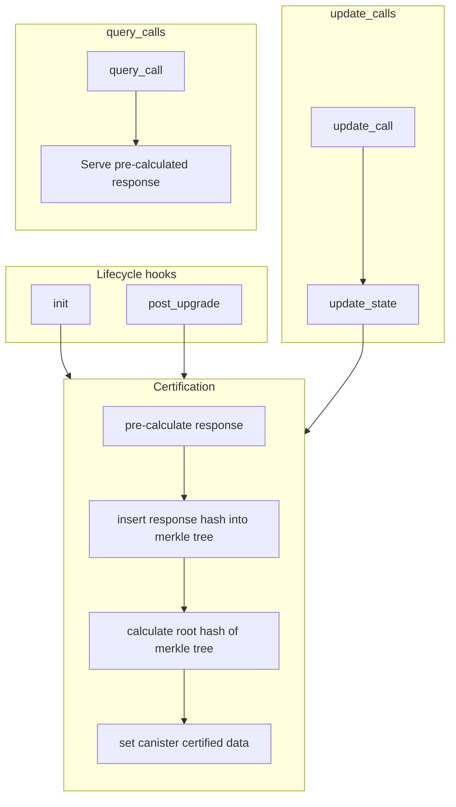
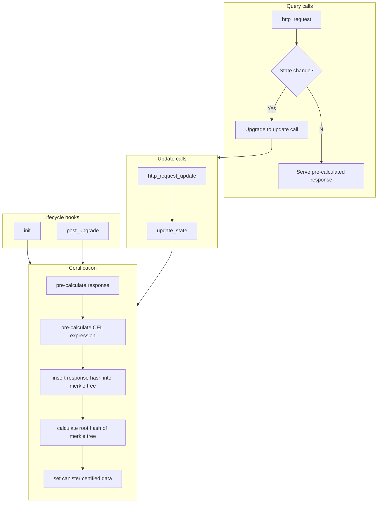

# Response Verification

## Introduction

The Internet Computer Protocol features two primary types of calls that can be used to interact with canisters: query calls and update calls.

| Query Calls                                            | Update Calls                                        |
| ------------------------------------------------------ | --------------------------------------------------- |
| Readonly, cannot change canister state.                | Can change canister state.                          |
| Response does not go through consensus.                | Response goes through consensus.                    |
| Answered by a single replica on the canister's subnet. | Answered by every replica on the canister's subnet. |

The different properties of query and update calls present a trade off in terms of performance and security. Since query call responses do not go through consensus and are fulfilled by only a single replica, they are much faster than update calls. In contrast, the lack of consensus poses a security concern and these responses cannot be trusted since any individual replica can arbitrarily change the response.

Canister certification provides a solution to this problem by pre-calculating responses and putting those pre-calculated responses through consensus. Consensus will produce a certificate for the pre-calculated responses that can be returned with the responses by any individual replica. Any clients requesting these responses can then verify this certificate to validate that consensus has agreed on this response prior to the request. This approach will give the performance characteristics of a query call, with the security profile of an update call, providing the best of both types of calls.

Canister certification is enabled by the [Certified data](https://internetcomputer.org/docs/current/references/ic-interface-spec/#system-api-certified-data) feature of the Internet Computer. This feature allows canisters to specify a 32 byte blob that will be included in consensus. How this 32 byte blob is determined is entirely up to canister developers to decide for themselves. This repo provides solutions that rely on merkle trees and won't discuss any other methods, but there are many other possibilities for imaginative developers that would like to roll their own solution.

In the next consensus round following this 32 byte blob being set (via [`ic0.certified_data_set`](https://internetcomputer.org/docs/current/references/ic-interface-spec/#system-api-certified-data)), the Internet Computer will prepare a certificate for the canister. This certificate, and the process for verifying it, is described in detail in the [interface spec](https://internetcomputer.org/docs/current/references/ic-interface-spec/#certification).

When responding to query calls, a canister can request the certificate (via [`ic0.certified_data_size`](https://internetcomputer.org/docs/current/references/ic-interface-spec/#system-api-certified-data) and [`ic0.certified_data_copy`](https://internetcomputer.org/docs/current/references/ic-interface-spec/#system-api-certified-data)) and then include this certificate in the response, to allow for clients to validate the response's authenticity.

## Standard Certification

The standard, or default, method of certification is the simplest form of certification. The high-level procedure for certification is as follows:

1. Pre-calculate any query call responses that need to be certified.
2. Arrange query call response hashes into a merkle tree.
3. Calculate the root hash of the merkle tree.
4. Set the root hash as the canister's certified data.
5. If an update call is received that changes state, return to step 1.
6. If a query call is received, return the pre-calculated response along with the certified data certificate.

There are a number of questions that a developer needs to answer on a per-project basis when using this style of certification that should be agreed upon with clients beforehand and done consistently by both client and canister:

- How are responses hashed?
  - What properties are included/excluded? (e.g., `response_timestamp` is excluded but `id` is included).
  - What format of each property is hashed? (e.g., leb, big/little endian encoding for numbers).
  - In what order are properties hashed? (e.g., sort properties alphabetically).
  - The [representation independent hash](https://internetcomputer.org/docs/current/references/ic-interface-spec/#hash-of-map) from the Internet Computer Protocol spec can be used, or serve as inspiration for developers.
- How are response hashes arranged in the tree?
  - Each exposed canister method should have a pre-determined path where its response hash will be presented in the merkle tree (e.g., the `get_count` method returns a response and the hash of this response is present at the `["count"]` path of the merkle tree).
  - This pre-determined path may use parameters of the request or calling principal to arrange more dynamic data in the tree (e.g., the `get_account` method returns a response and the hash of this response is present at the `["account", caller.to_text()]` path of the merkle tree).

### Process Flow



### Resources

- [`ic-certification` Cargo crate](https://crates.io/crates/ic-certification).
- [`ic-certification` docs](https://docs.rs/ic-certification/latest/ic_certification).
- [Example with a certified counter](./examples/certification/certified-counter/README.md).
- [`ic-certification` source code](./packages/ic-certification/README.md).
- [`ic-representation-independant-hash` Cargo crate](https://crates.io/crates/ic-representation-independent-hash).
- [`ic-representation-independant-hash` docs](https://docs.rs/ic-representation-independent-hash/2.3.0/ic_representation_independent_hash).
- [`ic-representation-independent-hash` source code](./packages/ic-representation-independent-hash/README.md).

## Certificate verification

Certifications of a response need to be verified by the caller. The process for this is as follows:

1. Extract the canister's certificate from the response and verify it:
   - If the certificate has a delegation:
     1. Verify the delegation's signature using the Internet Comptuer Protocol's public key.
     2. Assert that the delegation is valid for the canister's canister ID.
     3. Extract the subnet's public key from the delegation.
     4. Verify the certificate's signature using the subnet's public key.
   - Otherwise:
     1. Verify the certificate's signature using the Internet Computer Protocol's public key.
2. Verify that the certificate's time is not too far in the past or future.
3. Extract the canister's merkle tree from the response and calculate it's root hash.
4. Ensure that the merkle tree's root hash matches the canister's certified data in the certificate.
5. Calculate the hash of the canister's response.
6. Ensure that the response hash is in the merkle tree at the expected path.

Steps 1 through 4 (inclusive) is encapsulated by the `@dfinity/certificate-verification` (JavaScript) and the `ic-certificate-verification` (Rust) packages.

For testing code that verifies responses, the `@dfinity/certification-testing` (JavaScript) and `ic-certification-testing` (Rust, unpublished) packages can be used to create certifications.

### Resources

- [`@dfinity/certificate-verification` source code](./packages/certificate-verification-js/README.md).
- [`@dfinity/certificate-verification` NPM package](https://www.npmjs.com/package/@dfinity/certificate-verification).
- [`ic-certificate-verification` Cargo crate](https://crates.io/crates/ic-certificate-verification).
- [`ic-certificate-verification` docs](https://docs.rs/ic-certificate-verification/2.3.0/ic_certificate_verification).
- [`ic-certificate-verification` source code](./packages/ic-certificate-verification/README.md).
- [`@dfinity/certification-testing` NPM package](https://www.npmjs.com/package/@dfinity/certification-testing).
- [`@dfinity/certification-testing` source code](./packages/ic-certification-testing-wasm/README.md).
- [`ic-certification-testing` source code (unpublished)](./packages/ic-certification-testing/README.md).

## HTTP Certification

Canisters may leverage the [HTTP Gateway Protocol](https://github.com/dfinity/http-gateway) to serve HTTP-compatible responses to HTTP-aware clients, such as a web browser. This is a much more involved process than [standard certification](#standard-certification). With [standard certification](#standard-certification) canister developers are free to make a lot of decisions on their own because they will likely also control the clients that will be performing certification. This is in contrast to HTTP certification where a generic client (the [HTTP Gateway](https://github.com/dfinity/http-gateway)) will verify all canisters implementing this protocol.

### Process Flow



### Resources

- [`ic-http-certification` Cargo crate](https://crates.io/crates/ic-http-certification).
- [`ic-http-certification` docs](https://docs.rs/ic-http-certification/latest/ic_http_certification).
- [Example project serving a REST API](./examples/http-certification/json-api/README.md).
- [Example project with a custom implementation serving static assets](./examples/http-certification/custom-assets/README.md).
- [`ic-http-certification` source code](./packages/ic-http-certification/README.md).

## Response Verification

Response verification on the [Internet Computer](https://dfinity.org) is the process of verifying that an HTTP-compatible canister response from a replica has gone through consensus with other replicas hosting the same canister. It is the counterpart to [HTTP Certification](#http-certification).

The `ic-response-verification` and `@dfinity/response-verification` packages encapsulate this verification protocol. It is used by [ICX Proxy](https://github.com/dfinity/ic/tree/master/rs/boundary_node/icx_proxy) and the [local HTTP Proxy](https://github.com/dfinity/http-proxy) and may be used by other implementations of the [HTTP Gateway Protocol](https://internetcomputer.org/docs/current/references/ic-interface-spec/#http-gateway) in the future.

### Resources

- [`ic-response-verificaiton` source code](./packages/ic-response-verification/README.md)
- [`@dfinity/response-verification` source code](./packages/ic-response-verification-wasm/README.md)
- [Example project that verifies responses in NodeJS](./examples/response-verification/nodejs/README.md)
- [Example project that verifies responses in Rust](./examples/response-verification/rust/README.md)
- [Example project that verifies responses in the browser](./examples/response-verification/web/README.md)

## Miscellaneous Projects

### Representation Independent Hash

This is a utility crate to implement [representation independent hashing](https://internetcomputer.org/docs/current/references/ic-interface-spec/#hash-of-map) of data.

- [`ic-representation-independant-hash` Cargo crate](https://crates.io/crates/ic-representation-independent-hash).
- [`ic-representation-independant-hash` docs](https://docs.rs/ic-representation-independent-hash/2.3.0/ic_representation_independent_hash).
- [`ic-representation-independent-hash` source code](./packages/ic-representation-independent-hash/README.md).

### CBOR

This is a utilty crate to implement decoding of CBOR-encoded data.

- [`ic-cbor` Cargo crate](https://crates.io/crates/ic-cbor).
- [`ic-cbor` docs](https://docs.rs/ic-cbor/2.3.0/ic_cbor).
- [`ic-cbor` source code](./packages/ic-cbor/README.md).

## Contributing

Check out the [contribution guidelines](./.github/CONTRIBUTING.md).

### Command Reference

Make sure to follow the [system setup](#system-setup) instructions first.

| Command       | Description             |
| ------------- | ----------------------- |
| `cargo build` | Build all Cargo crates  |
| `cargo test`  | Test all Cargo crates   |
| `cargo fmt`   | Format all Cargo crates |
| `pnpm build`  | Build all NPM packages  |
| `pnpm test`   | Test all NPM packages   |
| `pnpm format` | Format all NPM packages |

#### Certification

| Command                                          | Description            |
| ------------------------------------------------ | ---------------------- |
| `cargo build -p ic-certification`                | Build Cargo crate      |
| `cargo test -p ic-certification`                 | Test Cargo crate       |
| `cargo doc -p ic-certification --no-deps --open` | Build Cargo crate docs |

#### Certificate Verification

| Command                                               | Description       |
| ----------------------------------------------------- | ----------------- |
| `pnpm run -F @dfinity/certificate-verification build` | Build NPM package |
| `pnpm run -F @dfinity/certificate-verification test`  | Test NPM package  |

#### Certification Testing

| Command                                                  | Description            |
| -------------------------------------------------------- | ---------------------- |
| `cargo build -p ic-certification-testing`                | Build Cargo crate      |
| `cargo doc -p ic-certification-testing --no-deps --open` | Build Cargo crate docs |
| `pnpm run -F @dfinity/certification-testing build`       | Build NPM package      |

### HTTP Certification

| Command                                               | Description            |
| ----------------------------------------------------- | ---------------------- |
| `cargo build -p ic-http-certification`                | Build Cargo crate      |
| `cargo test -p ic-http-certification`                 | Test Cargo crate       |
| `cargo doc -p ic-http-certification --no-deps --open` | Build Cargo crate docs |

### Response Verification

| Command                                                                 | Description            |
| ----------------------------------------------------------------------- | ---------------------- |
| `cargo build -p ic-response-verification`                               | Build Cargo crate      |
| `cargo test -p ic-response-verification`                                | Test Cargo crate       |
| `wasm-pack test --node packages/ic-response-verification --features=js` | Test Cargo crate WASM  |
| `cargo doc -p ic-response-verification --no-deps --open`                | Build Cargo crate docs |
| `pnpm run -F @dfinity/response-verification build`                      | Build NPM package      |
| `pnpm run -F @dfinity/response-verification test`                       | Test NPM package       |
| `./scripts/e2e.sh`                                                      | Run e2e tests          |

#### Representation Independent Hash

| Command                                                            | Description            |
| ------------------------------------------------------------------ | ---------------------- |
| `cargo build -p ic-representation-independent-hash`                | Build Cargo crate      |
| `cargo test -p ic-representation-independent-hash`                 | Test Cargo crate       |
| `cargo doc -p ic-representation-independent-hash --no-deps --open` | Build Cargo crate docs |

#### CBOR

| Command                                 | Description            |
| --------------------------------------- | ---------------------- |
| `cargo build -p ic-cbor`                | Build Cargo crate      |
| `cargo test -p ic-cbor`                 | Test Cargo crate       |
| `cargo doc -p ic-cbor --no-deps --open` | Build Cargo crate docs |

### System Setup

- [Install pre-commit](https://pre-commit.com/#installation)
- [Install commitizen](https://commitizen-tools.github.io/commitizen/#installation)
- [Install Rust](https://www.rust-lang.org/learn/get-started)
- [Install wasm-pack](https://rustwasm.github.io/wasm-pack/installer)
- [Install NVM](https://github.com/nvm-sh/nvm)
- [Install DFX](https://internetcomputer.org/docs/current/developer-docs/setup/install)

Install the correct version of NodeJS:

```shell
nvm install
```

Activate the correct version of NodeJS:

```shell
nvm use
```

Install and activate the correct version of PNPM:

```shell
corepack enable
```

### Working on WASM crates

Until Cargo supports [per package targets](https://github.com/rust-lang/cargo/issues/9406), the WASM crates are excluded from the `default_members` array of the Cargo workspace.
Commands such as `cargo build` and `cargo check` will not include these crates, so they must be built separately with the corresponding `pnpm` command listed under [projects](#projects).

Since `rust-analyzer` will also apply the same target to all crates, these crates will show errors in the IDE. To workaround this, create a `.cargo/config.toml` file:

```toml
[build]
target = "wasm32-unknown-unknown"
```

While this file exists, some of the non-WASM crates will show errors instead. Delete the file to work on the non-WASM crates.

### Making a Commit

```shell
cz commit
```

See [Conventional commits](https://www.conventionalcommits.org/en/v1.0.0) for more information on the commit message formats.

### Adding a new package

- Follow the [Package naming conventions](#package-naming-conventions) when naming the package.
- Add the package's package manager file to the `version_files` field in `.cz.yaml`.
  - `package.json` for NPM packages
  - Nothing for for Cargo crates, it is already covered by the root `Cargo.toml`
- Set the initial version of the package in its package manager file to match the current version in the `version` field in `.cz.yaml`
  - For `package.json`, set the version manually
  - For `Cargo.toml`, use `version.workspace = true`
- Add the package's package manager file(s) to the `add-paths` property in the `Create Pull Request` job of the `Create Release PR` workflow in `.github/workflows/create-release-pr.yml`
  - `package.json` for NPM packages
  - No files need to be added for Cargo crates
- If the package is a Rust crate:
  - Add the package to the `members` section in `Cargo.toml` and the `default-members` section
    - If the package must be compiled to WASM then do not add it to the `default-members` section
  - Add a `Release ic-<package-name> Cargo crate` job to the `Release` workflow in `.github/workflows/release.yml`
  - Add `target/package/ic-<package-name>-${{ github.ref_name }}.crate` to the `artifacts` property in the `Create Github release` job of the `Release` workflow in `.github/workflows/release.yml`
    - Make sure every entry except the last is comma delimited
  - If the crate has dependenencies in this repository, make sure it is published _after_ the dependencies
  - If the crate has a dependent in this repository, make sure it is published _before_ the dependents
- If the package is an NPM package:
  - Add the package to `pnpm-workspace.yaml`
  - Add a `Pack @dfinity/<package-name> NPM package` job to the `Release` workflow in `.github/workflows/release.yml`
  - Add a `Release @dfinity/<package-name> NPM package` job to the `Release` workflow in `.github/workflows/release.yml`
  - Add `dfinity-<package-name>-${{ github.ref_name }}.tgz` to the `artifacts` property in the `Create Github release` job of the `Create Release PR` workflow in `.github/workflows/create-release-pr.yml`
    - Make sure every entry except the last is comma delimited

### Package naming conventions

Cargo crates are named `ic-<package-name>`, likewise for the folder name.
If the Cargo crate will be compiled to WASM then the folder name is `ic-<package-name>-wasm`.

NPM packages are named `@dfinity/<package-name>`.
If the NPM package is a pure JS package then the folder name is `<package-name>-js`.
If the NPM package is built from a Rust crate then the folder name is `ic-<package-name>-wasm`.

### Referencing a Cargo crate

A Cargo crate can be referenced using a relative path in `Cargo.toml`:

```toml
[dependencies]
ic-response-verification-test-utils = { path = "../ic-response-verification-test-utils" }
```

If the _referencing_ Cargo crate is published to crates.io then the current version must be included and the _referenced_ crate must also be published:

```toml
[dependencies]
ic-response-verification-test-utils = { path = "../ic-response-verification-test-utils", version = "1.0.0" }
```

If a version is included in a dev dependency then the referenced dev dependency must also be published, but the version can be omitted for dev dependencies to avoid this.

### Referencing an NPM package

An NPM package can be referenced using the package name and [PNPM workspace protocol](https://pnpm.io/workspaces#workspace-protocol-workspace) in `package.json`:

```json
{
  "dependencies": {
    "@dfinity/certificate-verification": "workspace:*"
  }
}
```
